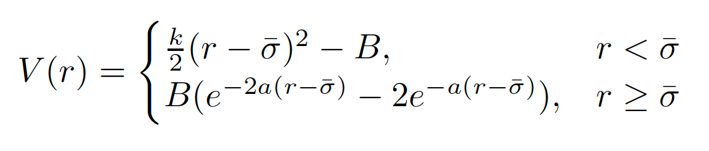

<h1 align="center">Designing athermal disordered solids with automatic differentiation</h1>
<h4 align="center">
<a href="https://arxiv.org/abs/2404.15101"></a>

</h4>
<div align="center">
  <span class="author-block">
    <a>Mengjie ZU</a><sup>1</sup> and</span>
  <span class="author-block">
    <a>Carl Goodrich</a><sup>1</sup></span>
</div>
<div align="center">
  <span class="author-block"><sup>1</sup>IST Austria</span>
</div>

$~$
<p align="center"></p>
<p align="center"></p>

# Introduction & Setup
We introduce a framework to control the properties of athermal disordered solids via automatic differetiation to directly connect desired properties with parameters, as described in [Designing athermal disordered solids with automatic differentiation] (https://arxiv.org/abs/2404.15101)

To conduct similar studies as those presented in the publication, start by cloning this reposity via
```
git clone 
```

# Dependencies

The framework was developed and tested on Python 3.9 and requires the following Python packages.
Package | Version (>=)
:-|:-
`jax[CPU]`       | `0.4.23`
`jax-md`        | `0.2.8`
`jaxopt`   | `0.8.2`
`optax` | `0.2.2`

The training programms run on single CPU for individual system and multiple CPUs for ensembles, see details in [Individual](#Individual) and [Ensemble](#Ensemble) for more information.

# Model
In our work, particles interact via a "harmonic-Morse" potential given by <br>

<br> where $\sigma$ is the mean of diameters of two particles, $B$ determines the strength of the attractions, and $k$ is the spring constant. We consider particle diameters $\sigma$ and binding energy $B_{ij}$ as design parameters. 

Readers can define their own interacting potential and design parameters. Note that, the design parameter should be a continuous variable because automatic differentiation can only estimate the gradient of a float variable.

# Training

## Individual
You can train an individual system by using the "scripts/run_individual.sh" script. The scipt generates a random initial energy minimized state with initial parameters, applies optimization, and saves the evolution of objective and parameters and the optimized configuration.


# Citation
If this code is useful for your research, please cite our [publication]().
```bibtex


