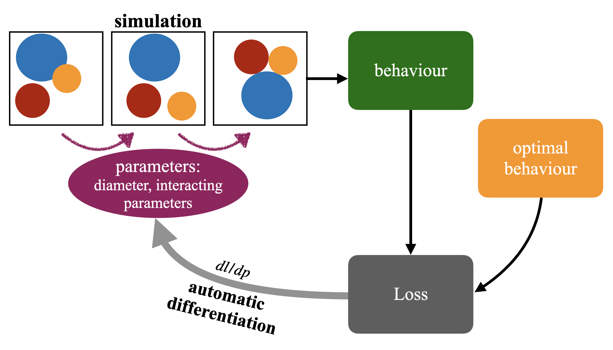

# Introduction & Setup
We introduce a framework to control the properties of athermal disordered solids via automatic differetiation to directly connect desired properties with parameters, as described in [Designing athermal disordered solids with automatic differentiation] (https://arxiv.org/abs/2404.15101)

<p align="center"></p>

# Dependencies

The framework was developed and tested on Python 3.10 and requires the following Python packages.
Package | Version (>=)
:-|:-
`jax`       | `0.4.35`
`jax-md`        | `master`
`jaxopt`   | ``
`optax` | ``

The training programms run on single CPU for individual system and multiple CPUs for ensembles, see details in [Individual](#Individual) and [Ensemble](#Ensemble) for more information.

```bash
pip install -U jax
git clone https://github.com/jax-md/jax-md.git
pip install -e jax-md
export JAX_ENABLE_X64=True
```

# Model
In our work, particles interact via a "harmonic-Morse" potential given by 

<p align="left"></p>

where $\sigma$ is the mean of diameters of two particles, $B$ determines the strength of the attractions, and $k$ is the spring constant. We consider particle diameters $\sigma$ and binding energy $B_{ij}$ as design parameters. 

Readers can define their own interacting potential and design parameters. Note that, the design parameter should be a continuous variable because automatic differentiation can only estimate the gradient of a float variable.

# Training

## Individual
You can train an individual system by using the `scripts/run_individual.sh` script. The scipt generates a random initial energy minimized state with initial parameters, applies optimization, and saves the evolution of objective and parameters and the optimized configuration.

## Ensemble
To reproduce the optimization process for ensemble averaged properties in the main text, you can run the demo `scripts/run_ensemble.sh`. Note that, we use `pmap` to parallellize the computation of the property over 8 samples, 

# Code
* `src`: source codes
    * `utils.py`: define utility functions
    * `minimization.py`: code to minimize the energy of a system via FIRE algorithm. It includes energy function with and without neighbor lists.
    * `optimizer_ind.py`: define optimizer for individual systems
    * `optimizer_ens.py`: define optimizer for ensemble averaged property
    * `energy.py`: define energy functions
    * `optimize_nu_individual.py`: the training script for individual system with target Poisson's ratio.
    * `optimize_nu_ensembles.py`: the main training code for ensemble averaged Poisson's ratio.
* `scripts`: scripts to reproduce optimization processes in the main text.

# Problems
If you find any bugs in the code or have any questions in running code, you are welcome to [create an issue]() in this repository or email us.

# Citation
If this code is useful for your research, please cite our [publication]().
```bibtex

# Pre-requeist

```
```
